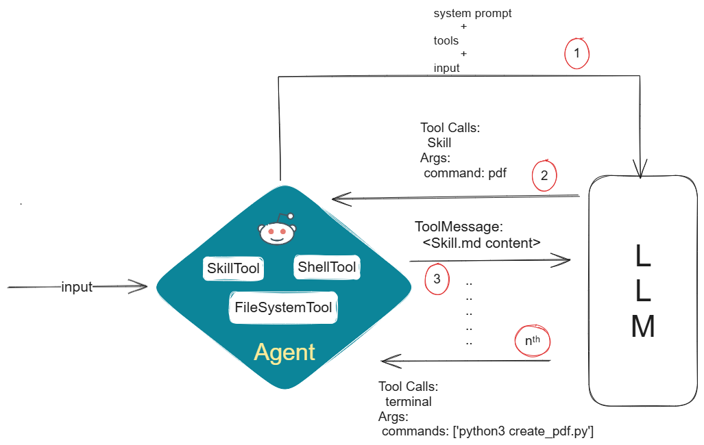

# LangChain Skills Adapter
This package provides an easy way to work with Agent Skills in your LangChain/LangGraph project by treating Skills as any other tool in LangChain, allowing you to easily integrate skills with existing workflows and agents. For developers, Skills work like any other LangChain tool.



## Installation

Install from PyPI:

```bash
pip install langchain-skills-adapter
```

## Create SkillTool
SkillTool accepts 2 arguments: `directories` (required) and `description_template` (optional).

### Supported Directory Structures:

Scenario 1 - Direct skill directory:
```
skills/
└── pdf/
    └── SKILL.md
```
Usage: `SkillTool(directories="skills/pdf")`

Scenario 2 - Parent directory with multiple skills:
```
.copilot/skills/
├── pdf/
│   └── SKILL.md
├── pptx/
│   └── SKILL.md 
└── excel/
    └── SKILL.md
```
Usage: `SkillTool(directories=".copilot/skills")`  # Discovers all three skills

Scenario 3 - Nested skill directories:
```
skills/
├── documents/
│   ├── pdf/
│   │   └── SKILL.md
│   └── word/
│       └── SKILL.md 
└── data/
    └── csv/
        └── SKILL.md
```
Usage: `SkillTool(directories="skills")`  # Recursively discovers all nested skills

Scenario 4 - Multiple parent directories:
```
~/.agents/skills/
└── pdf/
    └── SKILL.md

./custom-skills/
└── excel/
    └── SKILL.md
```
Usage: `SkillTool(directories=["~/.agents/skills", "./custom-skills"])`

```py
from langchain_skills import SkillTool

# Load skills from a directory
skill_tool = SkillTool(directories=".agent/skills/")
```

## Example Usage
```py
from langchain.agents import create_agent
from langchain_community.agent_toolkits import FileManagementToolkit
from langchain_community.tools import ShellTool
from langchain_skills import SkillTool

# create skill tool
skill_tool = SkillTool(directories=".agent/skills/")

# Create supporting tools to complement the skill
file_management_toolkit = FileManagementToolkit(root_dir='..').get_tools()
bash_tool = ShellTool()

# Combine all tools
tools = file_management_toolkit + [bash_tool, skill_tool]

agent = create_agent(model, tools)
```

It is highly recommended to provide FileManagementToolkit and ShellTool, which act as supporting tools in case your skill is not just a SKILL.md file. Even if the skill is a simple single SKILL.md file, it depends on what is actually written in that SKILL.md file. It depends on your use case.


# Important:
Since this setup makes use of FileSystemTools and ShellTool, ensure proper security and safety measures. This is not the responsibility of this library.

## Inspiration
This work is inspired by Spring AI's SkillTool implementation:  
https://github.com/spring-ai-community/spring-ai-agent-utils/blob/main/spring-ai-agent-utils/src/main/java/org/springaicommunity/agent/tools/SkillsTool.java

